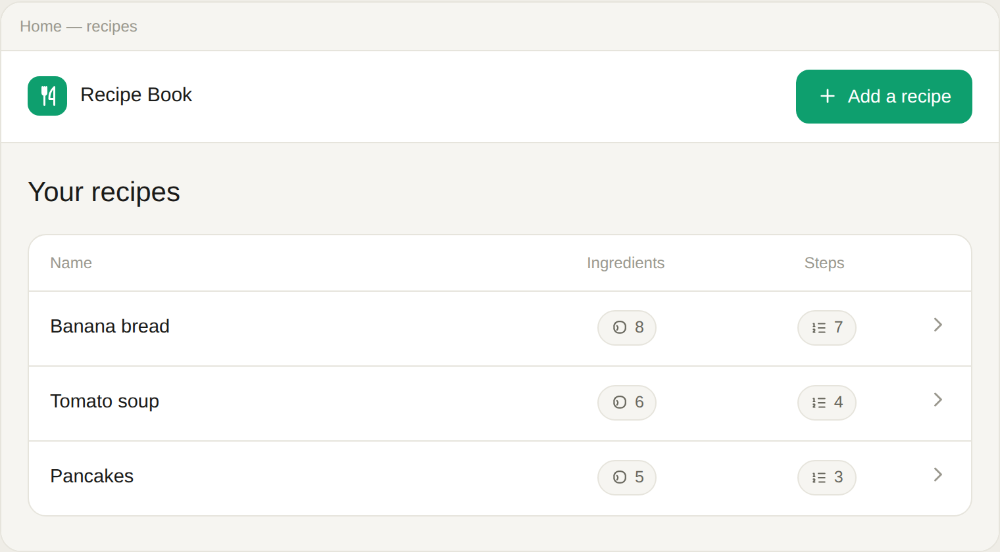
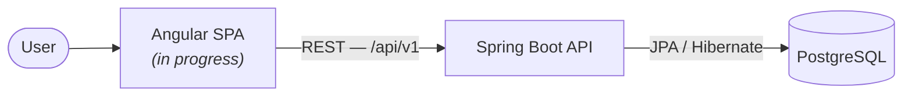

# Recipe Book

A full-stack web application for managing recipes — create, organise, and browse recipes with their ingredients and ordered preparation steps.

Built as a portfolio project demonstrating end-to-end, architecture-first engineering: a designed API contract, a modelled architecture and database, and a fully tested backend.

  
  
  
  

<i>Home screen — UI design. Frontend implementation is in progress; see <a href="docs/design">docs/design</a> for the full set.</i>

---

## Overview

Recipe Book lets a user keep a personal collection of recipes. Each recipe has a name, a description, an ordered list of steps, and a list of ingredients (name, unit, quantity). Recipes can be listed, viewed in full, created, edited, and deleted.

The project is developed **contract- and design-first**: the REST API is specified in OpenAPI, the architecture is modelled in C4, the database in DBML, and the interface in a full set of UI designs — all before implementation.

## Status

| Component | Status |
|---|---|
| Backend API | Built and tested |
| Frontend (Angular) | Designed — implementation in progress |
| Deployment | Planned |

## Architecture

A single-page frontend talks to a stateless REST backend over HTTP; the backend owns all persistence.

The full C4 model (system context, containers, components) is in [`docs/architecture`](docs/architecture); the database schema is in [`docs/database`](docs/database).

## Tech stack

| Layer | Technology |
|---|---|
| Frontend | Angular · TypeScript |
| Backend | Java 26 · Spring Boot 4.1 · Spring Framework 7 |
| Persistence | JPA / Hibernate · PostgreSQL 18 · Flyway |
| API | OpenAPI 3.1 (design-first) |
| Architecture & docs | C4 (Structurizr) · DBML |

## Repository layout

| Path | Contents |
|---|---|
| [`backend/`](backend) | Spring Boot REST API — build, run, and test instructions in its own [README](backend/README.md). |
| `frontend/` | Angular single-page application *(planned)*. |
| [`docs/`](docs) | Architecture (C4), database schema (DBML), the OpenAPI contract, and UI designs. |

## Getting started

The backend runs independently today. See [`backend/README.md`](backend/README.md) for prerequisites, how to run it against PostgreSQL, and how to run the test suite.

The frontend will be added under `frontend/` and documented there once implemented.

## Documentation

- **API contract** — [`docs/api/openapi.yaml`](docs/api/openapi.yaml)
- **Architecture (C4)** — [`docs/architecture`](docs/architecture)
- **Database schema** — [`docs/database`](docs/database)
- **UI designs** — [`docs/design`](docs/design)
